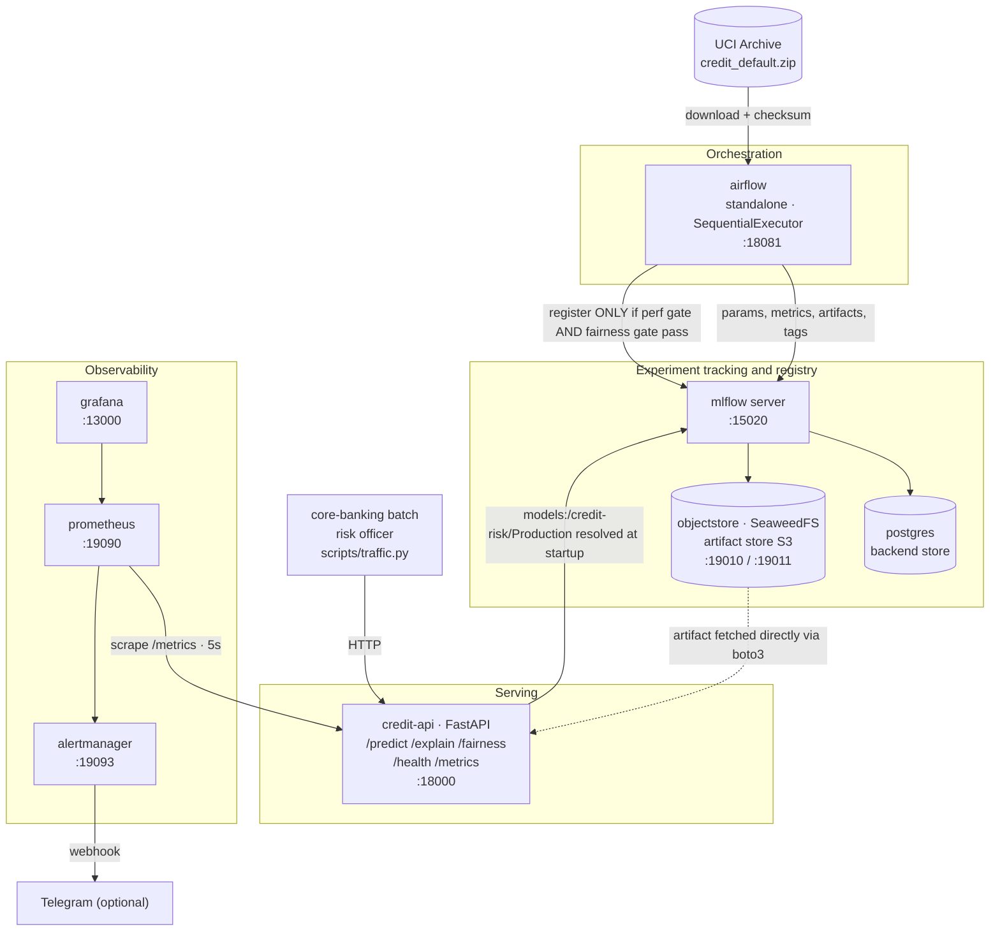
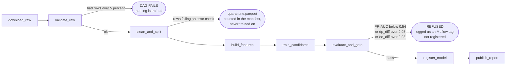
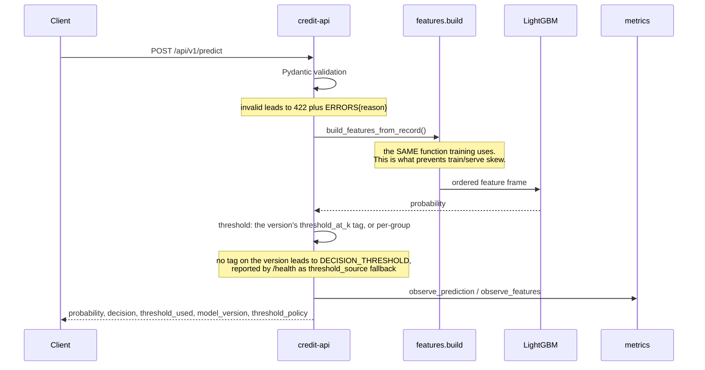

# Architecture

Credit Default Early-Warning System — DDM501 final project.

This document explains what the system is made of, how data moves through it,
and — the part that matters most — **why each decision was made and what was
given up to make it**. Every decision below has an alternative a reasonable
engineer would have picked, and a reason we did not.

---

## 1. Context

A consumer credit-card issuer holds ~30,000 active accounts. Each month some
holders fail to make the next minimum payment. The risk team can act on about
**10% of the portfolio per month** — roughly 3,000 accounts — through proactive
contact, restructuring offers, or limit reductions.

The system answers one question: **which accounts belong on next month's
intervention list?**

Two consequences shape the whole design:

1. The decision is a **ranking under a capacity constraint**, not a yes/no
   classification at p = 0.5. Every business metric, and the fairness gate, is
   computed at the capacity cut-off: the score that admits 10% of the held-out
   split (0.5167 for the run behind version 2). Registration writes that
   cut-off onto the model version as a `threshold_at_k` tag, and `/predict`
   decides at the tag of the version it loaded (D3). A version without the tag
   decides at the configured `DECISION_THRESHOLD` (0.5) instead, and `/health`
   reports `threshold_source: "fallback"`. Version 2 was registered before the
   tag existed and stays in that state until
   `python -m credit_risk.models.registry tag-threshold --version 2` fills the
   tag in from the metric its run logged.
2. The output affects people's access to credit. Explanation and fairness are
   therefore **functional requirements**, not reporting. In many jurisdictions a
   lender must be able to state why an adverse decision was made, and must not
   discriminate on sex or marital status.

---

## 2. System overview

### Services

| Service | Image | Host port | Single responsibility |
|---|---|---|---|
| `postgres` | `postgres:16-alpine` | 15432 | MLflow backend store (runs, params, metrics, registry) |
| `objectstore` | `chrislusf/seaweedfs` | 19010 / 19011 | MLflow artifact store, S3 API |
| `createbucket` | built (`Dockerfile.mlflow`) | — | One-shot job: create the bucket, then exit |
| `mlflow` | built | 15020 | Tracking server + Model Registry |
| `airflow` | built | 18081 | Pipeline scheduling and retries; backfill available but disabled (`catchup=False`) |
| `credit-api` | built | 18000 | Scoring, explanation, fairness report, metrics |
| `prometheus` | `prom/prometheus` | 19090 | Metric collection, alert rule evaluation |
| `alertmanager` | `prom/alertmanager` | 19093 | Alert grouping, deduplication, routing |
| `grafana` | `grafana/grafana` | 13000 | Dashboards, provisioned rather than clicked together |

Ports sit in the 1xxxx range on purpose: a machine that has been through this
course already has four lab stacks holding 5000, 8080, 9090 and 3000. Nothing
here needs a privileged port.

---

## 3. Data flow

### 3.1 Training path — Airflow DAG `credit_risk_pipeline`

Two edges carry most of the design intent.

**`validate_raw` can fail the DAG.** Training on unchecked data produces a model
that is confidently wrong, and the failure surfaces weeks later in production
rather than immediately in the pipeline. Failing loudly at ingestion is cheaper
than debugging a bad model. The report is pushed to XCom (key
`validation_report`) before the task checks the exit status, so a failed run
keeps its evidence.

**Under the 5% tolerance, bad rows are set aside, not trained on.**
`clean_and_split` assigns batches over the whole file, then moves every row that
failed an error-severity check to `data/processed/quarantine.parquet`, as
received and with the failed checks named. The manifest records
`quarantined_rows` and a count per check. Kept rows stay in the batch they
arrived in, so a bad row in batch 1 does not change who is in the test set. The
published file has no such rows, and its split hashes are unchanged.

**Only transient failures are retried.** `download_raw` retries connection
errors, timeouts and 408/425/429/5xx itself (4 attempts, 2/4/8 s backoff). If
the archive stays down it exits 75 (`EX_TEMPFAIL`), the one exit code
`run_module` maps to a retryable `AirflowException`; Airflow then applies the
DAG's two retries. Every other non-zero exit is a defect and fails the task
without a retry.

**A failed run raises an alert.** The DAG's `on_failure_callback` posts one
alert per failed task to Alertmanager's v2 API (`ALERTMANAGER_ALERTS_URL`,
default `http://alertmanager:9093/api/v2/alerts`) with
`alertname=PipelineTaskFailed`, `severity=critical`, `dag_id` and `task_id`. It
stays firing for 24 hours unless a successful run resolves it first
(`on_success_callback`). Neither callback can raise.

**The raw parquet is trusted only with its sidecar.** The download writes the
parquet and its provenance sidecar (archive SHA-256 plus the parquet's own
digest) to temporary files and renames them into place, sidecar first. A
parquet with no sidecar, or one its sidecar does not describe, is downloaded
again, so a crash cannot leave the manifest with `source_sha256: null`.

**Batches are cut by `ID`, and `ID` is not time.** The file has no date
column, so the six "arrivals" are ID ranges. They are not equally risky: the
default rate is 22.8% in train (batches 1–4), 20.4% in test (batch 5) and 21.2%
in the serving pool (batch 6), against 22.1% overall. Test metrics are measured
on a population with a lower base rate than the one the model was fitted on,
and none of this is evidence about behaviour over time. We keep the ID split
because it is deterministic and documented; DATASHEET.md states the same.

**`evaluate_and_gate` can refuse to register.** A candidate that beats the
baseline on PR-AUC but breaches the fairness gate is **not promoted**. The
refusal is recorded as a run tag, because "we tried this and rejected it for this
reason" is a result worth keeping.

### 3.2 Serving path — per request

---

## 4. Decisions and trade-offs

Each entry states what we chose, what we rejected, and the price we pay.

### D1 — Modular monolith for the API, not microservices

**Chosen.** One FastAPI service with clear internal module boundaries
(`serving/`, `explain/`, `features/`, `fairness/`).

**Rejected.** Separate `predict`, `explain` and `fairness` services.

**Why.** There is one model and one team of four working for four weeks.
Microservices would add network hops, service discovery, distributed tracing and
four more health checks — all real cost, all zero benefit at this scale. Clear
component responsibilities are a property of **module** boundaries, and we get
them from the package layout, one package per concern, not by putting a network
between them. Nothing checks the import graph automatically; the boundaries are
a convention kept by review.

**Price.** `/explain` and `/predict` scale together. One explanation runs SHAP
and LIME, and LIME alone makes 1,000 perturbed predictions, so a burst of
explanation traffic degrades scoring latency. We accept it because explanation
is a human-in-the-loop action (one risk officer opening one account) while
scoring is a nightly batch, so the peaks do not coincide. If that assumption
breaks, lifting `explain/` into its own service is possible but not free:
`serving/routes.py` calls both explainers directly, those calls would become
HTTP requests, and both explainers import `serving/model_loader.py` to build
their feature frames, so the dependency runs both ways today.

### D2 — Batch scoring, not streaming

**Chosen.** Nightly batch scoring plus on-demand single lookups.

**Rejected.** Kafka and stream processing.

**Why.** The business action is a monthly intervention list. Nothing in the use
case has a sub-second requirement. Kafka would add two or three containers, a
partitioning and retention policy, consumer-lag monitoring and an at-least-once
delivery story — an operational discipline with real ongoing cost, bought to
solve a latency problem this system does not have.

**Price.** A limit change made today is not reflected until tonight's run. For
this use case that is correct behaviour, not a limitation.

### D3 — MLflow Registry is the source of truth for the model

**Chosen.** The API resolves `models:/credit-risk@champion` at startup and
downloads the artifact from the object store. When no version carries the
alias it falls back to `models:/credit-risk/Production`, and `/health` reports
which one answered as `model_ref: "alias" | "stage"`.

**Rejected.** Baking a `model.pkl` into the serving image.

**Why.** This is the difference between *having Docker* and *having MLOps*.
Promoting a new model version becomes a registry operation — no rebuild, no
redeploy of application code. It also lets `/health` report **which** model is
serving, which is the first question anyone asks during an incident.

An alias rather than a stage because stages are deprecated in MLflow and an
alias names a role (`champion`, `challenger`) instead of a fixed lifecycle
slot. Promotion still sets the Production stage, so the MLflow UI and anything
else reading stages agree; the stage fallback exists for this project's own
registry, whose version 2 was promoted before the alias was used
(`python -m credit_risk.models.registry set-champion --version 2` ends it).

Promotion is a decision, not a side effect of training. `register_model`
promotes a candidate that passed the gates only when there is no champion, or
when its held-out PR-AUC — logged on the same split, which each run records by
hash — is no more than `PROMOTION_PR_AUC_TOLERANCE` (0.005, about half the
cross-validation spread) below the champion's. Any other candidate is
registered as the `challenger` (stage Staging) with a tag saying why, and a
person promotes it with `set-champion` or leaves it.

The decision threshold travels the same way. `register_model` tags each version
with `threshold_at_k` (the capacity cut-off its evaluation computed),
`capacity_fraction`, `trained_at`, `git_sha` and `run_id`. The API resolves the
champion's version number first, loads the model by that version's own URI,
and reads the cut-off from that version's tags, so the tags always describe the
estimator that was loaded even if another version is promoted in between. Promoting a
version moves its cut-off with it; nothing in configuration changes.
`THRESHOLD_SOURCE=env` opts out and decides at `DECISION_THRESHOLD`.

**Price.** The model is resolved once, at startup, so a promotion reaches
traffic only after `docker compose restart credit-api` or a deploy, which
restarts and then runs `scripts/verify_deploy.py`. There is no reload endpoint:
an unauthenticated call that swaps the model is a worse risk than a restart.

The API also depends on MLflow at startup. Mitigated by
`depends_on: service_healthy` and by starting in an explicit **degraded** state
(`/health` reports `model_loaded: false`, `/predict` returns 503) instead of
crash-looping. A service that refuses to boot cannot tell you why it is unhappy.

The threshold has a price of its own. A version registered before the tags
existed, or one whose tag could not be written, has no cut-off of its own. It
decides at `DECISION_THRESHOLD`, logs a warning at startup naming the backfill
command, and `/health` reports `threshold_source: "fallback"`. That state is
visible, not silent, and it is still a fixed number that was not computed for
the model in front of it. The cut-off is also computed on batch 5 and applied
to later traffic. If the population moves, the share flagged moves away from
10%, which is what `HighRiskShareShift` watches.

### D4 — Postgres and an S3 object store behind MLflow, not SQLite and a folder

**Chosen.** Client-server backend store and S3-compatible artifact store.

**Which one.** SeaweedFS, after MinIO became unpullable: `minio/minio` on Docker
Hub denies anonymous pulls and every quay.io tag now requires authentication.
CI caught it; a machine with the image cached never would. Both speak the same
S3 API, so boto3, `--default-artifact-root` and the bucket job are unchanged.

**Rejected.** `sqlite:///mlflow.db` with a local artifact directory.

**Why.** SQLite serialises writers and does not survive concurrent pipeline runs;
a local artifact folder cannot be read by another container without a shared
mount. Both are right for a tutorial and wrong for a system. Running the real
topology is also what makes the `service_completed_successfully` dependency on
bucket creation necessary — a detail that only appears once the artifact store is
genuinely remote.

**Price.** Two more containers and roughly 300 MB of RAM.

### D5 — Airflow standalone in one container, not CeleryExecutor

**Chosen.** `apache/airflow:2.8.4` in `standalone` mode, `SequentialExecutor`,
SQLite metadata DB.

**Rejected.** The canonical CeleryExecutor deployment (webserver, scheduler,
worker, redis, metadata DB). Also rejected: no orchestrator at all.

**Why.** We want scheduling, retries with exponential backoff (applied to
transient failures only, see §3.1), a run history UI, and backfill available
when we need it. Standalone gives all of them for **one**
container. Backfill is deliberately disabled (`catchup=False`): with `@daily`
from 2026-01-01, turning it on would queue one training run for every day since
then, over 270 of them, one after another on the SequentialExecutor.
CeleryExecutor gives distributed workers, which a handful of sequential tasks
over 30,000 rows will never need. Dropping the orchestrator entirely would mean
writing retry, backoff, partial-rerun and run-history logic by hand in a shell
script — which is how a pipeline ends up with no error handling at all.

**Price.** No task parallelism, no horizontal scaling. Both irrelevant here.

### D6 — Two interpreters inside the Airflow image

**Chosen.** Airflow keeps its own constrained dependency set; the project is
installed into a second virtualenv at `/opt/credit-risk/venv`, and the DAG shells
out to it through `CREDIT_RISK_PYTHON`.

**Rejected.** Installing LightGBM, SHAP and LIME alongside Airflow in one
interpreter.

**Why.** Airflow 2.8.4 pins `pandas` and `numpy` through its constraints file.
This project needs different versions plus three libraries Airflow has no opinion
about. Resolving both sets into one interpreter means one of them silently loses,
and the symptom appears later as a wrong number rather than an install error. Two
interpreters in one image make the isolation **visible**.

**Price.** A larger image and a `subprocess` boundary instead of a Python import,
so the DAG sees exit codes and stdout rather than exceptions. The child's output
is piped into the task log to keep failures debuggable.

### D7 — LightGBM as the candidate, logistic regression as the baseline

**Chosen.** Both are trained on every run and compared in MLflow.

**Rejected.** LightGBM only. Also rejected: deep learning.

**Why.** The baseline is not ceremony. It quantifies what gradient boosting
actually buys, and turns the interpretability trade-off into a number instead of
an opinion. LightGBM is also directly supported by `shap.TreeExplainer`, which
computes exact Shapley values for tree ensembles rather than the sampling
approximation `KernelExplainer` would need. Deep learning on 30,000 rows of
tabular data loses to gradient boosting and makes explanation an order of
magnitude slower.

**Price.** Two model families to maintain, evaluate and test.

### D8 — CI on GitHub-hosted runners, CD on a self-hosted runner

**Chosen.** Two workflows on two kinds of runner. `ci.yml` runs every gate on
`ubuntu-latest`, with a matrix over Python 3.11 and 3.12. `deploy.yml` runs on a
self-hosted runner labelled `credit-risk`, installed on the machine that runs the
compose stack. It starts only when CI succeeds on a push to `main`, deploys the
exact commit CI tested, trains and registers a model only if nothing is in
Production, restarts the API, and fails unless the API serves the version the
registry holds in Production (`scripts/verify_deploy.py`). Registering the
runner is [`docs/RUNNER.md`](docs/RUNNER.md).

**Rejected.** Everything on the self-hosted runner, as in Labs 4 and 5.
Everything on hosted runners, deploying into the host over SSH or a tunnel. And
no CD at all: `make up` by hand after each merge.

**Why.** CI and CD want opposite things from a runner. CI must be green when
nobody's laptop is awake: a reviewer opening the repository at midnight must see
a real, current build status, and a self-hosted runner is green only while
somebody's machine is on. The version matrix exists because the serving image
runs 3.12 while the Airflow-side virtualenv runs 3.11 — so that divergence is
**tested** rather than hoped about. Deployment is the reverse. Its target is one
particular machine: the one running the stack, with the MLflow registry and
every model artifact in its volumes. A hosted runner cannot reach it — a laptop
sits behind NAT with no inbound route — and opening one would mean a tunnel plus
a credential that controls Docker on that host, stored in GitHub. A self-hosted
runner needs neither: it only makes outbound HTTPS connections to GitHub to pick
up jobs. Deploying by hand was rejected because it is the step that gets
skipped, and then the stack runs whatever was last built with nothing recording
which commit or which model that is.

**Price.** Deploys happen only while the host is up. A merge while it is off
leaves the deploy job queued, and GitHub fails a job no runner picks up within
24 hours. The runner executes workflow code on that host, as the user who
installed it and with full control of Docker, so it is acceptable only on a
**private** repository: on a public one, a pull request from a fork can point
any workflow at it. The deploy job therefore runs only from `main`, only after
CI, and never on `pull_request`; its `workflow_run` condition also requires the
CI run to be a push to this repository, because a fork can name a branch `main`
too. CI still has no ARM64 coverage — on an Apple-silicon host the deploy build
is where an ARM64-only failure would surface, after the merge rather than
before it — and the dataset must be downloaded (and cached) inside the CI
workflow.

### D9 — Fairness thresholds are a gate, not a paragraph

**Chosen.** `demographic_parity_difference <= 0.05` and
`equalized_odds_difference <= 0.08` block registration.

**Rejected.** Measuring fairness in a notebook and writing it up.

**Why.** A number in a notebook protects the one model that was examined. A gate
in the pipeline protects **every future model**, including one retrained by
somebody who never read the report. That is the difference between an audit and a
control.

**Price.** A genuinely better-performing model can be refused. That is the
intended behaviour; refusals are logged with their reason so the trade-off is
visible rather than silent.

### D10 — Multi-stage Dockerfile, non-root runtime

**Chosen.** Builder stage carries the compiler toolchain; runtime stage carries
neither the toolchain nor root.

**Rejected.** A single-stage image.

**Why.** Shipping `build-essential` to production means a larger image and a
larger attack surface, and neither is needed to answer an HTTP request.
`libgomp1` is installed in the runtime stage because LightGBM links against
OpenMP — without it the import fails with a linker error that reads like a
missing Python package but is not one.

**Price.** A more complex Dockerfile and a longer cold build.

---

## 5. Observability design

Metrics were chosen by asking *what would somebody actually need answered at
3 a.m.*, not by exporting whatever was easy to instrument.

| Metric | Type | Labels | Question it answers |
|---|---|---|---|
| `credit_predictions_total` | Counter | `decision` | How much traffic, and how much is being flagged |
| `credit_errors_total` | Counter | `reason` | What is failing, specifically |
| `credit_prediction_latency_seconds` | Histogram | `endpoint` | The shape of latency, not its mean |
| `credit_explain_duration_seconds` | Histogram | `method` | What SHAP costs against LIME |
| `credit_model_loaded` | Gauge | — | The process answers, but does it have a model? |
| `credit_model_info` | Gauge (=1) | `version`, `algo`, `trained_at`, `git_sha` | **Which** model was serving during the incident |
| `credit_high_risk_share` | Gauge | — | Has the answer distribution moved? (NaN until 50 requests have been scored since startup) |
| `credit_baseline_high_risk_share` | Gauge | — | What this model version flags on the 500-row reference sample at startup: the baseline `HighRiskShareShift` compares against |
| `credit_selection_rate` | Gauge | `group` | **Are groups being treated differently, right now?** |
| `credit_feature_psi` | Gauge | `feature` | Has the input distribution moved, and where? |

Two notes.

**`credit_model_info` is a gauge permanently stuck at 1.** The value is
meaningless; the labels are the payload. It looks strange until the first time
you join on it to find out which model version produced a bad batch.

**Cardinality is bounded on purpose.** No metric is ever labelled by account ID.
Lab 4 demonstrated the failure: identical traffic went from 23 time series to 639
after adding one per-request label. `tests/unit/test_metrics.py` asserts the
series count stays under 60 after 1,000 observations, so the guarantee is tested
rather than trusted.

### Alerts

Every rule has a `for:` clause. Without it, one unlucky scrape pages somebody, and
almost every false page traces back to a missing `for:`.

| Alert | Severity | Why somebody should be woken |
|---|---|---|
| `ApiDown` | critical | No successful scrape for a minute |
| `ModelNotLoaded` | critical | The API answers and every prediction is a 503. A port check calls this healthy. |
| `HighErrorRate` | warning | More than 5% of requests failing |
| `SlowPredictions` | warning | p95 above 100 ms |
| `SlowBatchPredictions` | warning | p95 of `/predict/batch` above 500 ms |
| `SlowExplanations` | info | p95 above 500 ms |
| `HighRiskShareShift` | warning | Answers moved more than 10 points from `credit_baseline_high_risk_share` (what this model flags on its reference sample), for 15 minutes; silent below 50 scored requests |
| `FeatureDriftHigh` | warning | PSI above 0.25 on some feature |
| **`FairnessGapExceeded`** | warning | **Selection-rate gap between groups above 5 points** |

`FairnessGapExceeded` is the alert an ordinary web service never has. When it
fires, latency is normal, the error rate is zero, every dashboard an SRE would
check is green — and the system is discriminating. That failure mode is why ML
systems need their own operational discipline, and it is the centre of this
project's argument.

---

## 6. Quality gates

| Gate | Threshold | Enforced by |
|---|---|---|
| Lint | zero findings | `ruff check` and `ruff format --check` in CI |
| Types | zero errors on `src/` | `mypy` in CI |
| Test coverage | at least 80% | `pytest --cov-fail-under=80` |
| Test breadth | unit, integration, data quality, model | four test directories, all run in CI: the fast tests in the `test` matrix, every `tests/model` test in its own `model` job, the data-quality suite and the real-batch model test in `data_quality` |
| Model behaviour | ROC-AUC at least 0.78, Brier at most 0.14, monotone in delinquency, invariant to `SEX` on the mitigated path | `tests/model` in the `model` job (synthetic fixture); the PR-AUC and ROC-AUC floors again on the real held-out batch in `data_quality` |
| Alert rules | each tested rule fires when it should and stays quiet when it should | `promtool test rules` in the `alert rules` job |
| Dependencies | known advisories listed on every push; **not yet a gate** | `pip-audit` in the `dependency audit` job (report-only), Dependabot weekly |
| Data quality | bad-row fraction at most 5% | `validate_raw` fails the DAG |
| Model performance | PR-AUC at least 0.54 | `evaluate_and_gate` blocks registration |
| Fairness | dp at most 0.05, eo at most 0.08 | `evaluate_and_gate` blocks registration |
| Served capacity | the API flags 10% ± 1 point of accounts the cut-off was not computed on | `tests/integration/test_serving_threshold.py` in the `test` job (synthetic pool); `tests/model/test_served_capacity.py` in `data_quality` (real `serving_pool`) |
| Runtime health | a model is loaded and serving | container `HEALTHCHECK` and `scripts/smoke.sh` |
| Deployment | the API serves the version the registry holds in Production, and scores a sample account | `scripts/verify_deploy.py` in `deploy.yml` |

---

## 7. What would change at ten times the scale

Stated explicitly, because the honest answer to *does this architecture scale* is
*it does not need to, and here is what would change if it did.*

| Pressure | First thing that breaks | Change |
|---|---|---|
| 300k accounts, hourly scoring | `SequentialExecutor` | Airflow with Celery or Kubernetes executor |
| Many concurrent explanations | SHAP and LIME sharing the serving process | Extract `explain/` into its own service — the package boundary exists, but `serving/routes.py` and the explainers call each other directly and would need an HTTP interface (see D1) |
| Several models, several teams | A single registry stage per model | Model namespacing and a per-model promotion policy |
| A genuinely regulated deployment | SQLite metadata, anonymous Grafana | Managed Postgres, SSO, audit logging, a secret manager |
| A real streaming requirement | Batch ingestion | Kafka and an online feature store — the point at which D2 and D5 would be revisited |
