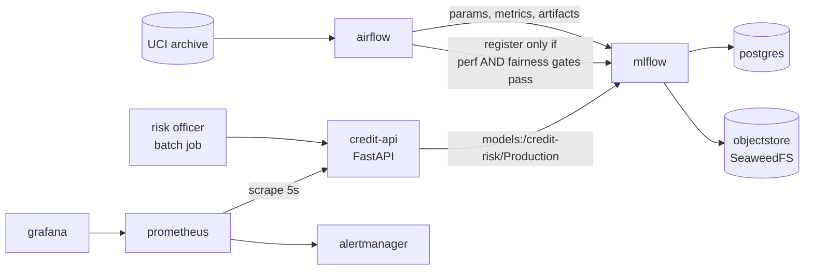

# Credit Default Early-Warning System

[](https://github.com/maxnguyen83/credit-risk-mlops/actions/workflows/ci.yml)
[](#testing)
[](pyproject.toml)
[](#license)

An end-to-end ML system that ranks credit-card accounts by their probability of
defaulting next month, so a risk team with capacity for 10% of the portfolio
knows which accounts to contact.

**DDM501 — AI in DevOps, DataOps, MLOps · Final Group Project**

> This is coursework. The model must not be used for real credit decisions —
> see [`ETHICS.md`](ETHICS.md) and [`MODEL_CARD.md`](MODEL_CARD.md) for why.

---

## What this actually is

Most of the code here is not the model. The model is a LightGBM classifier that
trains in two seconds. Everything else is the machinery that makes it safe to
operate:

- a **data pipeline** that refuses to train on data it has not validated
- an **experiment tracker and registry** that records which model is serving and
  why it was promoted
- a **serving API** that explains every decision it makes
- **monitoring** that detects the one failure mode ordinary dashboards cannot see:
  a system that is completely healthy and quietly discriminating
- **CI** that runs on every push and pull request to `main`: lint, types,
  coverage, model-quality and alert-rule tests, and a live smoke test of the
  composed stack (plus a release workflow that publishes the image on a `v*` tag)
- **CD** onto the machine that runs the stack: a self-hosted runner deploys every
  commit CI passes on `main`, and fails the deploy unless the API serves the
  model the registry holds in Production

The interesting claim of the project is in that fourth bullet, and there is a
one-command demo of it below.

---

## Results

Measured on the held-out split (5,000 accounts never seen in training):

| | Value | Target | Check |
|---|---|---|---|
| PR-AUC | **0.5668** | ≥ 0.54 | blocks registration |
| ROC-AUC | **0.7930** | ≥ 0.78 | asserted in tests |
| Brier score | **0.1243** | ≤ 0.14 | asserted in tests |
| Recall@10% capacity | **0.3490** | ≥ 0.33 | reported |
| — of the achievable ceiling (0.490) | **71.2%** | ≥ 67% | reported |
| Precision@10% | **0.7120** | — | reported |
| Lift@10% | **3.49×** | ≥ 2.2× | reported |
| Demographic parity difference (`SEX`) | **0.0384** | ≤ 0.05 | blocks registration |
| Equalized odds difference (`SEX`) | **0.0725** | ≤ 0.08 | blocks registration |
| Avoided expected loss | **NT$10,608,000** | > 0 | reported |

The last column says what happens to a model that misses its target.
**Blocks registration**: `evaluate_and_gate` refuses it and it never reaches the
registry. **Asserted in tests**: a test in `tests/model/` fails. **Reported**:
the number is logged to MLflow and nothing stops the model.

These are the numbers from the model currently registered as `credit-risk`
version 2 in the Production stage (MLflow run `3914189d`, registered by the
Airflow DAG; version 1 logged the same figures). Reproduce them with
`make dag-test`; every run logs the same table to MLflow.

Recall is reported against a ceiling because one exists: with 10% intervention
capacity and a 20.4% base rate, **no ranker can exceed `0.10 / 0.204 = 0.490`**.
An absolute target above that is not ambitious, it is arithmetic nobody checked.

Full breakdown, including per-group metrics and the three mitigation strategies
we compared, is in [`MODEL_CARD.md`](MODEL_CARD.md).

---

## Quickstart

**Prerequisites:** Docker (or Colima) with ~4 GB available, Python 3.11 or 3.12,
`make`.

```bash
git clone https://github.com/maxnguyen83/credit-risk-mlops.git
cd credit-risk-mlops
cp .env.example .env            # edit the passwords; .env is gitignored

make install                    # virtualenv + package + dev tools
make up                         # bring up all 9 services
make ps                         # wait for mlflow and airflow to report healthy

make dag-test                   # the pipeline once: download, validate, split,
                                # train, gate, register, report
docker compose restart credit-api   # the API loads the Production model at startup
make ps                         # credit-api turns healthy once a model is loaded

make smoke                      # prove the running stack answers correctly
```

`credit-api` stays unhealthy until a model is registered and the API restarted:
its healthcheck passes only when `/health` reports `"model_loaded": true`, so
waiting for it before registering a model waits forever. `make data` and
`make train` run the first steps on their own; `make train` trains, evaluates
and records the gate verdict but does not register anything. Registration is
the DAG's `register_model` task (`python -m credit_risk.models.registry`).

| | URL | Notes |
|---|---|---|
| API + Swagger | <http://127.0.0.1:18000/docs> | interactive, with worked examples |
| MLflow | <http://127.0.0.1:15020> | runs, metrics, artifacts, registry |
| Airflow | <http://127.0.0.1:18081> | `docker compose exec airflow cat /opt/airflow/standalone_admin_password.txt` |
| Prometheus | <http://127.0.0.1:19090> | Status → Targets shows `credit-api` UP |
| Alertmanager | <http://127.0.0.1:19093> | |
| Grafana | <http://127.0.0.1:13000> | anonymous viewer, 3 dashboards provisioned |
| Object store | <http://127.0.0.1:19011> | SeaweedFS filer browser |

Ports are in the 1xxxx range on purpose — a machine that has been through this
course already has four lab stacks holding 5000, 8080, 9090 and 3000.

### Alert delivery

Out of the box Alertmanager sends nothing: every receiver is a no-op, alerts
are grouped and shown in its UI and in Grafana, and the stack needs no secret to
start. Put a Telegram bot token and a chat id, as two files, in
`monitoring/alertmanager/secrets/` (gitignored) and run
`docker compose up -d alertmanager`, and the same routes deliver to that chat:
critical alerts and pipeline failures within seconds, warnings silently and
grouped per component. Anything incomplete falls back to the no-op config with a
warning in the log. Step by step, including finding the chat id:
[`docs/ALERTING.md`](docs/ALERTING.md).

---

## Try it

**Score one account.**

```bash
curl -s -X POST http://127.0.0.1:18000/api/v1/predict \
  -H 'Content-Type: application/json' \
  -d @docs/examples/high_risk.json | jq
```

```json
{
  "account_id": null,
  "default_probability": 0.7369284676988783,
  "decision": "intervene",
  "risk_band": "high",
  "threshold_used": 0.5,
  "threshold_policy": "base",
  "model_name": "credit-risk",
  "model_version": "2",
  "served_at": "2026-10-03T04:18:41Z",
  "request_id": "b6efbb2d31d946269a3643ac296bf048"
}
```

The same account with a clean repayment history
([`docs/examples/low_risk.json`](docs/examples/low_risk.json)) scores
`0.0632` and comes back `monitor` / `low`.

**Where `threshold_used` comes from.** The risk team can act on 10% of the
portfolio, so the cutoff is the score that admits exactly 10% of the held-out
split: the `threshold_at_k` every training run logs. Registration writes it onto
the model version as a tag, and the API reads that tag when it loads the version
(`THRESHOLD_SOURCE=registry`, the default). `/health` says which cutoff is in
force and where it came from:

```bash
curl -s http://127.0.0.1:18000/health | jq '{model_version, run_id, threshold, threshold_source}'
```

Version 2, which the response above came from, was registered before versions
carried the tag. It decides at the configured fallback, `DECISION_THRESHOLD=0.5`,
and `/health` reports `"threshold_source": "fallback"`. Measured offline on
version 2's training configuration, 0.5 flags 10.56% of the held-out split and
10.56% of `serving_pool` (batch 6, never trained or evaluated on); version 2's
own capacity threshold, 0.5167, flags 10.00% and 10.14%. One command fills the
tag in from the metric the run already logged, with no retraining:

```bash
.venv/bin/python -m credit_risk.models.registry tag-threshold --version 2 --dry-run  # show the tags
.venv/bin/python -m credit_risk.models.registry tag-threshold --version 2
docker compose restart credit-api       # version tags are read when the model loads
curl -s http://127.0.0.1:18000/health | jq '.threshold, .threshold_source'
```

The command talks to MLflow at `MLFLOW_TRACKING_URI` (default
`http://localhost:15020`; `--tracking-uri` overrides it), only adds tags the
version is missing, and so changes nothing when run twice. Versions registered
from now on carry the tag from the start. `THRESHOLD_SOURCE=env` makes the API
ignore the tag and decide at `DECISION_THRESHOLD`, and `/health` then says
`"env"`.

**Ask why.**

```bash
curl -s -X POST http://127.0.0.1:18000/api/v1/explain \
  -H 'Content-Type: application/json' \
  -d @docs/examples/high_risk.json | jq '.top_reasons, .agreement'
```

```json
[
  "The time since the last missed payment (1) increased the estimated risk of default.",
  "The repayment status last month (2) increased the estimated risk of default.",
  "The total billed over six months (7704) increased the estimated risk of default."
]
{ "top3_overlap": 1, "note": "SHAP and LIME agree on 1 of the top 3 drivers." }
```

Two explainers are served and the response reports how far they agree. On this
record they agree on **one** of three drivers, and that is what the API says.
Reporting the disagreement is the point: a single attribution method is a claim
nobody can check, and picking whichever ranking reads better is how an
explanation becomes decoration.

---

## The demo that makes the point

```bash
make traffic     # normal load
make drift       # covariate shift
make bias        # skewed group mix
make broken      # malformed payloads
```

Every number below was **measured on the running stack**, not predicted, with
version 2 deciding at the 0.5 fallback described above. They have not been
re-measured at its capacity threshold.

| Scenario | What moves | Alert | Outcome |
|---|---|---|---|
| `make traffic` | baseline established | — | `credit_selection_rate` male **0.128** / female **0.082** |
| `make drift` | `credit_feature_psi` 0.03 → **12.1** | `FeatureDriftHigh` | **pending** (threshold 0.25; its `for: 20m` outlasts the 300 s run) |
| `make broken` | error rate → **30.8%** | `HighErrorRate` | **fires** (threshold 5%) |
| `make bias` | mix skews to 95% male | `FairnessGapExceeded` | **does not fire** — gap 0.025, threshold 0.05 (`--bias` changes who arrives, not within-group rates; `for: 15m` also outlasts the run) |

Watch Grafana during `make drift`.

**Latency stays flat. The error rate stays at zero. Uptime is 100%. Every panel
an SRE would check is green — and `credit_feature_psi` goes to 12 while the
share of accounts flagged falls from 12.4% to 4.5%.** Nothing is broken and the
answers changed. That is the failure mode ML systems have and ordinary web
services do not, and it is why this project exists.

### The honest result about the fairness alert

`FairnessGapExceeded` **did not fire in any scenario we ran**, and we are
reporting that rather than tuning the threshold until it did.

There are two independent reasons, and both are worth saying out loud. The
structural one: `--bias` changes the *mix* of arrivals, not how the model treats
a given group, so it moves the population without moving a within-group rate.
The mechanical one: the rule carries `for: 15m` and our scenario runs last
300 seconds, so even a breached expression could not have fired in that window.
`FeatureDriftHigh` reached `pending` for exactly this reason — the expression
was true, the clock had not run out.

The measured selection-rate gap is **0.046** under the normal arrival mix
(male 0.128, female 0.082), 0.025 under a 95%-male mix, and 0.040 with
group-aware thresholds switched on — all inside the 0.05 policy limit. The
alert is wired, its expression evaluates on live data, and it is silent because
the system is within policy. A monitor that only proves itself by firing is a
monitor nobody has tested in its normal state.

Two things follow, and both are worth arguing about:

1. **The threshold has 0.4 of a point of headroom, not one.** Measured on live
   traffic under the normal arrival mix the rates are male **0.128** and female
   **0.082** — a gap of **0.046** against a limit of 0.05. The 0.025 figure comes
   from the skewed `--bias` run, not from normal operation, so quoting it
   understates the problem. With 0.004 of margin and a 15-minute `for:` clause,
   a slightly different population makes this alert flap. A wider limit would be quieter and less useful; a tighter one would page
   somebody about the model's ordinary behaviour. We chose 0.05 to match the
   registration gate, so the monitor and the gate enforce the same policy — and
   we are stating the cost of that choice rather than discovering it in
   production.
2. **Turning on the fairness mitigation makes this metric worse, by design.**
   Group-aware thresholds improve equalized odds (0.0725 → 0.0202) and widen the
   selection-rate gap (0.025 → 0.040), because demographic parity and equalized
   odds are different things and you cannot maximise both. The monitor catches
   exactly that trade-off.

`make demo` runs the whole narrated sequence.

---

## Architecture



Nine services, one `docker compose up`. The full picture, plus **ten design
decisions with the alternative we rejected and the price we pay**, is in
[`ARCHITECTURE.md`](ARCHITECTURE.md). Each decision also has its own ADR under
[`docs/adr/`](docs/adr/).
Requirements, with the test, alert or CI job that verifies each one, are in [`REQUIREMENTS.md`](REQUIREMENTS.md).

Two of them matter more than the rest:

- **The MLflow Registry is the source of truth for the served model.** Promoting
  a new version is a registry operation, not an image rebuild. The cutoff the
  version decides at travels with it as a version tag, and `/health` reports
  which model is actually serving and which cutoff it applies.
- **`features/build.py` is the single source of feature construction**, imported
  by both training and serving. Train/serve skew is prevented at the architecture
  level, and a test asserts the two paths produce byte-identical output.

---

## Project layout

```
src/credit_risk/
  schema.py          the data contract — column names, valid codes, gates, base rates
  config.py          all runtime configuration, read once from the environment
  data/              download · validate · clean · split (deterministic, hashed)
  features/build.py  THE single source of feature construction
  models/            train · evaluate · registry (with the promotion gate)
  fairness/          metrics · three mitigation strategies · the trade-off curve
  explain/           SHAP · LIME · agreement between them
  serving/           FastAPI app · routes · Pydantic contracts · Prometheus metrics
dags/                the Airflow pipeline
monitoring/          prometheus · alert rules · alertmanager · provisioned grafana
scripts/             traffic generator (drift / bias / broken) · smoke · demo
                     verify_deploy · stack_health (used by the deploy workflow)
tests/               unit · integration · data_quality · model
docs/adr/            one file per architectural decision
docs/RUNNER.md       the self-hosted runner that deployment runs on
```

---

## Testing

Five kinds of test, because five kinds of thing can break.

| Kind | What it protects | Run |
|---|---|---|
| **unit** | feature arithmetic, PSI, thresholds, fairness formulas | `pytest tests/unit` |
| **integration** | API contracts, status codes, error paths, metric exposition | `pytest tests/integration` |
| **data quality** | schema, ranges, nulls, category codes, split determinism | `pytest tests/data_quality` |
| **model** | performance floor, directional sanity, protected-attribute invariance | `pytest tests/model` |
| **alert rules** | each tested alert fires when it should and stays quiet when it should, including on an idle API | `promtool test rules monitoring/prometheus/tests/rules_test.yml` |

All five run in CI. The slow model tests have their own job, and the alert-rule
tests run in the same `prom/prometheus` image the stack deploys.

```bash
make test          # everything, with the >=80% coverage gate
make test-fast     # skip anything needing the dataset or the stack
```

Four tests are worth reading on their own:

- **train/serve parity** — the same record through the training path and the
  serving path must produce byte-identical features. This is the architectural
  claim, asserted rather than trusted.
- **protected-attribute invariance** — on the mitigated path, which drops the
  protected columns, flipping `SEX` must leave the feature frame identical and
  the probability moved by exactly 0.0; the unmitigated control must move by
  more than 0.02, so the test cannot pass on a model that learned nothing. Under
  group-aware thresholds, only the accounts between the two cutoffs may change
  decision. This makes the fairness claim falsifiable.
- **metric cardinality** — the exported series count stays under 60 after 1,000
  predictions. Lab 4 showed identical traffic going from 23 series to 639 by
  adding one per-request label; this test is the guard rail.
- **served capacity** — a model is registered into a throwaway MLflow, promoted,
  loaded by the API's own startup path, and a pool of accounts it was never
  evaluated on is scored through `/predict/batch`. The share flagged must land
  within a point of the 10% capacity, and the API's count must equal the
  offline one to the account. On the synthetic fixture this runs on every push
  (`tests/integration/test_serving_threshold.py`); on the real `serving_pool` it
  runs once the dataset is downloaded (`tests/model/test_served_capacity.py`).

---

## CI/CD

**Continuous integration** runs on GitHub-hosted runners
([`ci.yml`](.github/workflows/ci.yml)) on every push and pull request to `main`:
ruff, mypy, the test matrix on 3.11 and 3.12 with the 80% coverage gate, the
model and data-quality tests, promtool, a dependency audit, the image build and a
smoke test of the composed stack.

### Continuous deployment

[`deploy.yml`](.github/workflows/deploy.yml) runs on a self-hosted runner
labelled `credit-risk`, on the machine that runs the stack — a GitHub-hosted
runner cannot reach it ([D8](ARCHITECTURE.md#d8--ci-on-github-hosted-runners-cd-on-a-self-hosted-runner)).
When CI passes on a push to `main` it:

1. checks out the commit CI tested, rebuilds the images and runs
   `docker compose up -d`; the volumes, and with them the registry, are kept;
2. waits for the Postgres, object store, MLflow and Airflow healthchecks,
   fetches the dataset if it is missing, and runs the pipeline once only if
   nothing is in Production;
3. restarts the API so it loads the current Production model, and waits for
   every service to report ready;
4. runs `scripts/verify_deploy.py`, which fails the deploy unless the version
   MLflow holds in Production, the version `/health` reports and the version
   that scores `docs/examples/high_risk.json` are the same.

The run summary records the commit, the model version and stage served, and the
health of every container. Registering the runner, deploying by hand and
removing the runner are in [`docs/RUNNER.md`](docs/RUNNER.md).

```bash
gh workflow run deploy.yml --ref main   # deploy main by hand; refused unless CI passed on it
make deploy-check                       # on the host: is the API serving the registry's model?
```

---

## Responsible AI

| | Where |
|---|---|
| Dataset provenance, base rates by group, known encoding errors | [`DATASHEET.md`](DATASHEET.md) |
| Per-group metrics, three mitigation strategies and their cost | [`MODEL_CARD.md`](MODEL_CARD.md) |
| Harms, the legality conflict, feedback loops, limits | [`ETHICS.md`](ETHICS.md) |
| Live fairness monitoring | Grafana → *Fairness Monitor* |

Three things we will not soften:

1. The model flags men **1.46× as often** as women (12.15% against 8.31%). It
   passes the parity gate at 0.0384. **Passing a gate is not the same as being
   fair** — the gate is where somebody wrote their policy down.
2. **Dropping the protected columns is not enough.** It lowers the
   equalized-odds gap by a third but barely moves parity, and a linear probe
   still recovers `SEX` from the remaining features at ROC-AUC 0.566 — a floor,
   since a linear probe is the weakest one could use — because utilisation and
   repayment behaviour are proxies.
3. **The fairest option may be illegal.** `ThresholdOptimizer` achieves the
   smallest gap by applying different thresholds per group, which many
   jurisdictions forbid in a credit decision. We ship the group-blind policy by
   default, implement and measure the other, and report the cost of the legal
   constraint as a number.

---

## Troubleshooting

**`Library not loaded: @rpath/libomp.dylib` when importing LightGBM (macOS).**
LightGBM links against OpenMP, which macOS does not ship.

```bash
brew install libomp
```

Linux and the Docker images are unaffected — `libgomp1` is installed in the
runtime stage.

**`/health` reports `model_loaded: false`.** Nothing is registered yet, or the
API started before the model was. Run `make dag-test`, then
`docker compose restart credit-api`: the Production model is loaded once, at
startup. The API starts in a degraded state on purpose: a service that refuses
to boot cannot tell you why it is unhappy.

**`/health` reports `"threshold_source": "fallback"`.** The serving version
carries no `threshold_at_k` tag, so decisions are made at `DECISION_THRESHOLD`
rather than at the version's capacity threshold. Versions registered before the
tag existed look like this. Run
`.venv/bin/python -m credit_risk.models.registry tag-threshold --version <N>`,
then `docker compose restart credit-api`. The API log says the same thing at
startup, with the version number filled in.

**`mlflow` container restarts, logs mention a missing bucket.** `createbucket`
did not finish. `docker compose logs createbucket`, then
`docker compose up -d --force-recreate mlflow`.

**`docker compose up` fails with `unauthorized` pulling the object store.** You
are on an old revision that used MinIO. Its community images were withdrawn —
Docker Hub denies anonymous pulls and quay.io requires auth on every tag. The
stack uses SeaweedFS now; pull the latest `main`.

**`make ps` shows `credit-api` unhealthy.** Same cause and same fix as above.
Prometheus keeps scraping it regardless of Docker's health status; the degraded
state shows up as `credit_model_loaded 0` and, after two minutes, the
`ModelNotLoaded` alert.

**Ports already in use.** The lab stacks from Tutorials 2–5 may still be running:
`docker ps` then `docker compose -p <lab-name> down`.

**Airflow tasks fail with an import error.** The DAG shells out to a separate
interpreter on purpose — see [ADR 0006](docs/adr/0006-two-interpreters-in-airflow-image.md).
Check `CREDIT_RISK_PYTHON` is set inside the container.

**Colima runs out of memory.** The stack needs ~2.3 GB.
`colima stop && colima start --cpu 4 --memory 8`.

---

## Team

See [`CONTRIBUTING.md`](CONTRIBUTING.md) for the four-way split, the git
workflow, and the definition of done. Each member owns one vertical slice of the
system **and** one piece of Responsible AI — because all four will be asked about
it.

## License

Coursework for DDM501, FSB — FPT University. The dataset is distributed by the
UCI Machine Learning Repository under CC BY 4.0; cite Yeh and Lien (2009).
